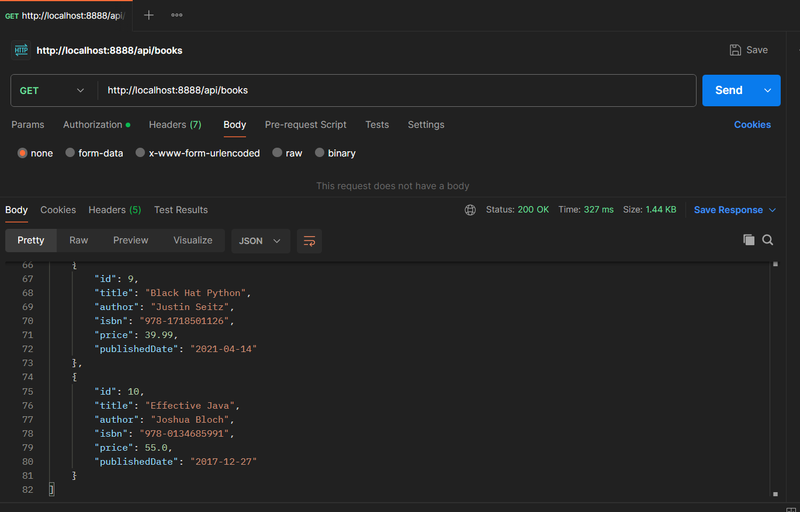
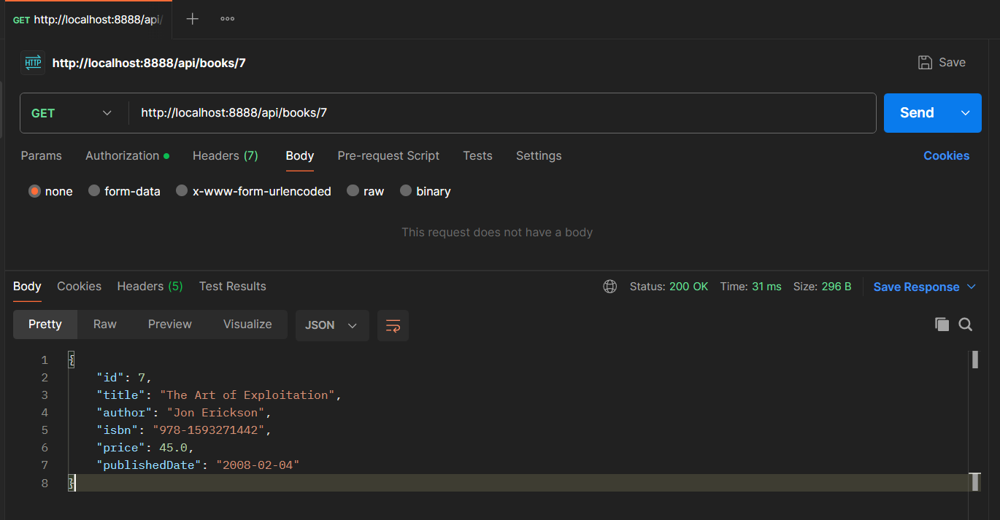
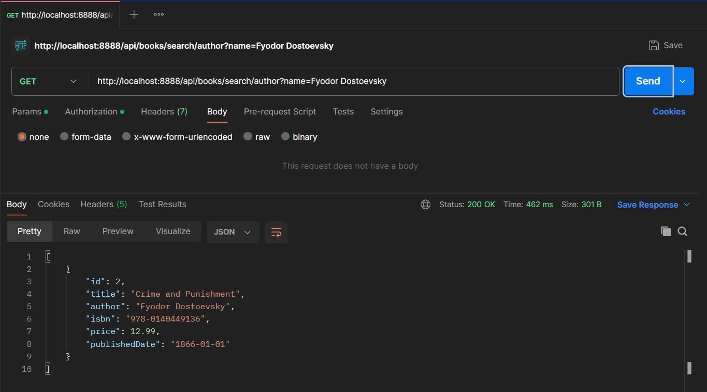
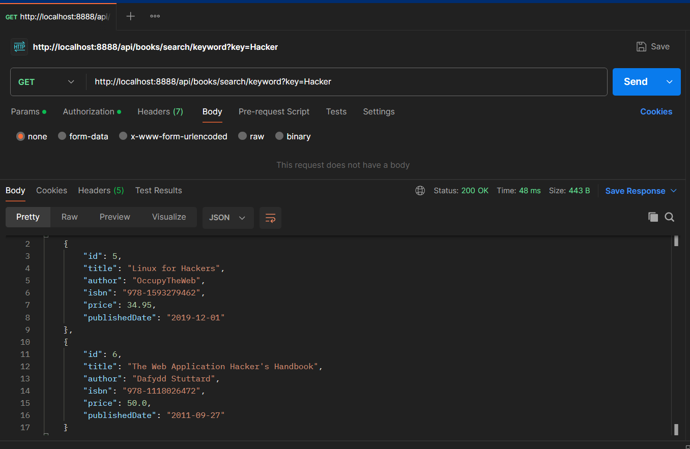
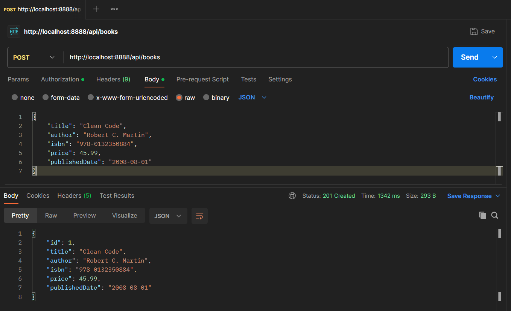
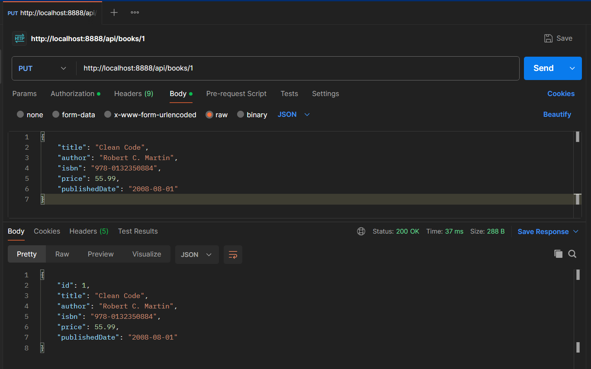
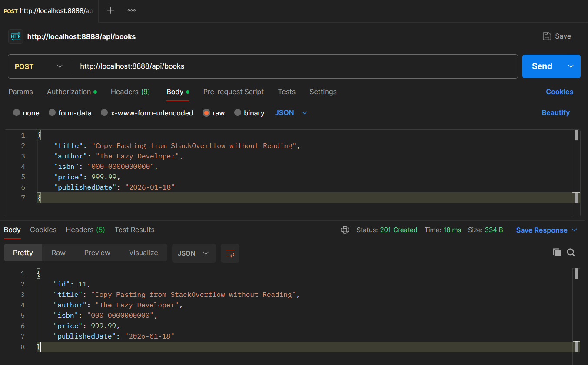
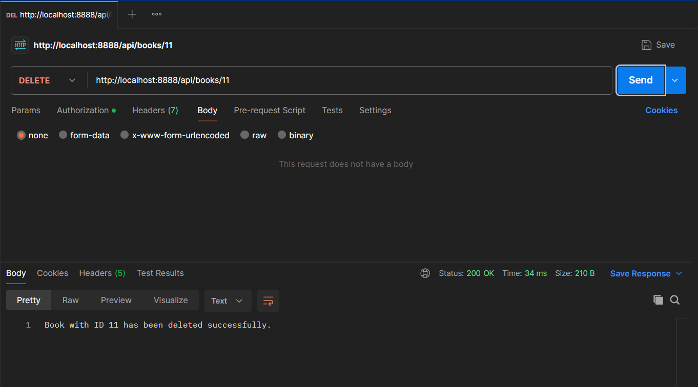
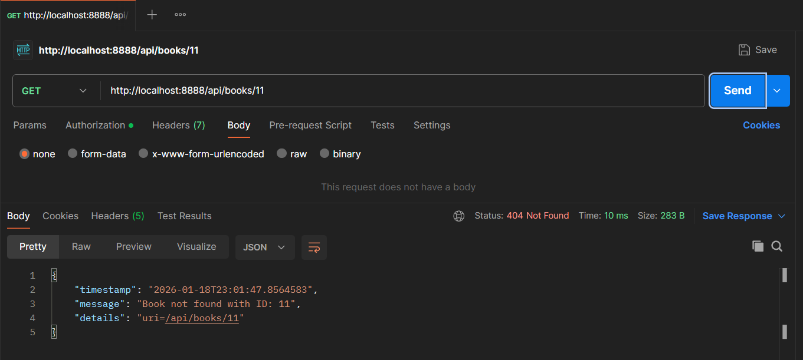
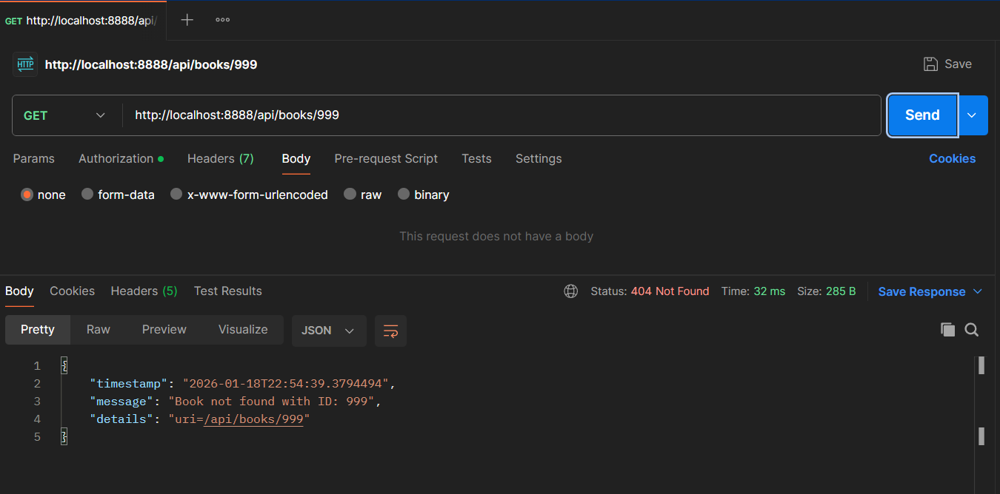

# BookStream: Enterprise-Grade Book Management System

**BookStream** is a robust, production-ready RESTful API built with **Spring Boot** and **Oracle 21c**. 
This project demonstrates a full migration from a local prototype made initially using Collections like ArrayLists to a persistent, 3-tier enterprise architecture integrated with Oracle 21c, complete with global exception handling and professional package naming.

## 🚀 Key Features
* **3-Tier Architecture:** Complete separation of concerns across Controller, Service, and Repository layers for high maintainability.
* **Oracle 21c Persistence:** Integrated with a real-world RDBMS using Spring Data JPA and native Oracle sequence generators.
* **Global Exception Handling:** Centralized error management using `@RestControllerAdvice` to ensure standardized, professional JSON responses.
* **Scalable Data Mapping:** Leveraging **Lombok** to reduce boilerplate code and **Hibernate** for automated schema management.

---

## 🛠️ Technology Stack
* **Language:** Java 25 (LTS)
* **Framework:** Spring Boot 4.0.1
* **Database:** Oracle 21c (ojdbc11)
* **Architecture:** 3-Tier (Controller-Service-Repository)
* **Testing:** Postman

---

## 📂 Project Structure
```text
src/main/java/com/example/
├── controller/    # REST Endpoints (Request Mapping)
├── entity/        # Database Models (JPA Entities)
├── exception/     # Custom Exceptions & @RestControllerAdvice
├── repository/    # Data Access Layer (Spring Data JPA)
└── service/       # Business Logic Layer (Interfaces & Impl)

```
## 📸 API Documentation & Visual Proof

*The following results demonstrate rigorous testing performed via Postman to verify the full CRUD lifecycle and database integrity.*

### 1. Data Retrieval (GET Operations)
Demonstrating precise data retrieval and custom query logic using Spring Data JPA.

**Retrieve All Records**
Successfully fetching all records from the Oracle `LIBRARY` table.


**Fetch by Specific ID**


**Advanced Search: Author & Keyword**
Testing case-insensitive author search and partial title keyword matching.



---

### 2. Data Persistence & Modification (POST & PUT)
Verifying data persistence and real-time modification within the RDBMS.

**Create New Record (POST)**


**Update Existing Record (PUT)**


---

### 3. The Lifecycle of a Deletion (The "Architectural Exorcism")
A step-by-step demonstration of resilient deletion and custom error handling.

**Step A: Adding a temporary record to be deleted**


**Step B: Executing the DELETE request**


**Step C: Verification & Global Exception Handling**
Attempting to fetch the deleted record triggers our custom `BookNotFoundException`.



---

## 📡 API Endpoints

| Method | Endpoint | Description | Implementation Detail |
| :--- | :--- | :--- | :--- |
| **GET** | `/api/books` | Retrieve all books | Returns a list from Oracle `LIBRARY` table |
| **GET** | `/api/books/{id}` | Find book by ID | Throws `BookNotFoundException` if invalid |
| **GET** | `/api/books/search/author` | Search by Author | Case-insensitive matching (`IgnoreCase`) |
| **GET** | `/api/books/search/keyword` | Search by Title | Uses `Containing` for partial matching |
| **POST** | `/api/books` | Create new record | Maps JSON body to JPA Entity |
| **PUT** | `/api/books/{id}` | Update book details | Updates existing record using JPA `save()` |
| **DELETE**| `/api/books/{id}` | Remove book record | Deletes entry from Oracle DB via Repository |

---


**Developed by Madhuchhanda Das**
[LinkedIn](https://www.linkedin.com/in/madhuchhanda-das-518072281/) | [GitHub](https://github.com/latenightcoder-git)
